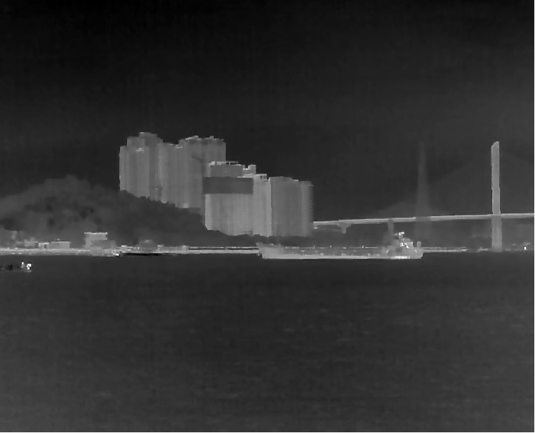
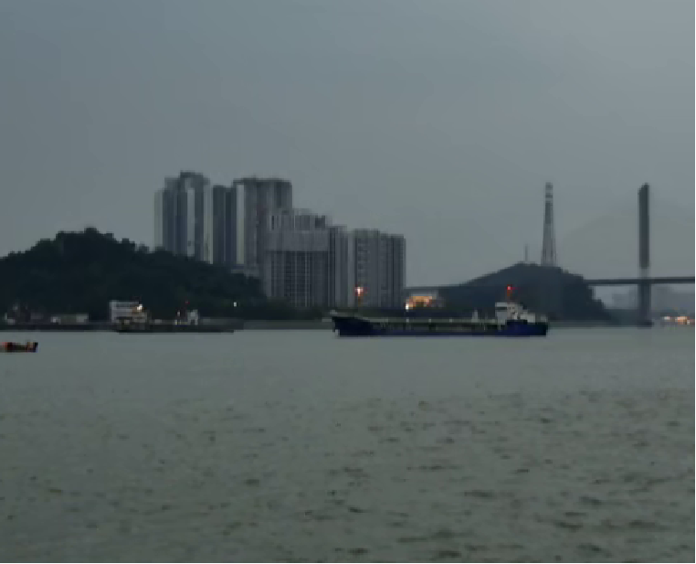
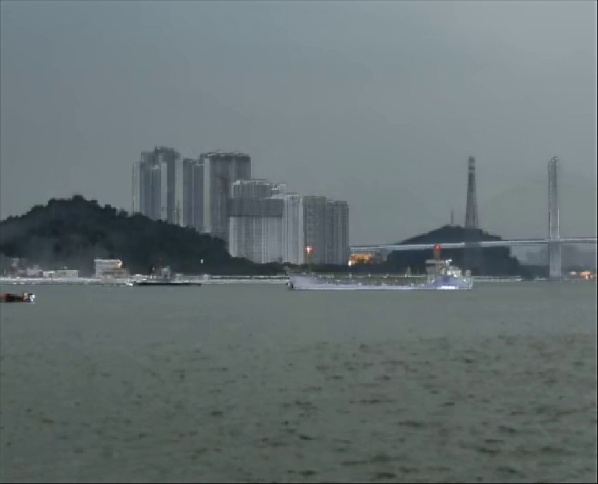

# PEFuse

[](https://www.python.org/downloads/release/python-3100/)
[](https://pytorch.org/)
[](https://developer.nvidia.com/cuda-11-8-0-download-archive)

Official implementation of the paper **"PEFuse: Progressive Emphasis of Dual-Frequency Feature for Infrared and Visible Image Fusion"**, published in *IEEE Transactions on Aerospace and Electronic Systems (TAES)*.

---

## Installation

```bash
# Create Conda environment
conda create -n PEFuse python=3.10
conda activate PEFuse

# Install CUDA toolkit
conda install cudatoolkit=11.8 -c nvidia
conda install -c "nvidia/label/cuda-11.8.0" cuda-nvcc

# Install PyTorch with CUDA support
pip install torch==2.1.1 torchvision==0.16.1 torchaudio==2.1.1 --index-url https://download.pytorch.org/whl/cu118

# Install dependencies
pip install -r requirements.txt
```


## Quick Start

```bash
# Clone the repository and enter the directory
git clone https://github.com/zocern/PEFuse.git
cd PEFuse

# Run the inference script
python inference.py \
  --model_path ./weight/infrared_visible_fusion/model/ \
  --iter_number 10000 \
  --dataset MaritimeShip \
  --ir_dir ir \
  --vi_dir vi \
  --vi_chans 3
```


## Results

The fused results will be automatically saved in the `result/PEFuse_{args.dataset}/` directory. For the example above, you can find the output images in `result/PEFuse_MaritimeShip/`.

<p align="center">
  
  
  
</p>

<p align="center">
  <em>From left to right: Infrared image, Visible image, and our Fused result.</em>
</p>